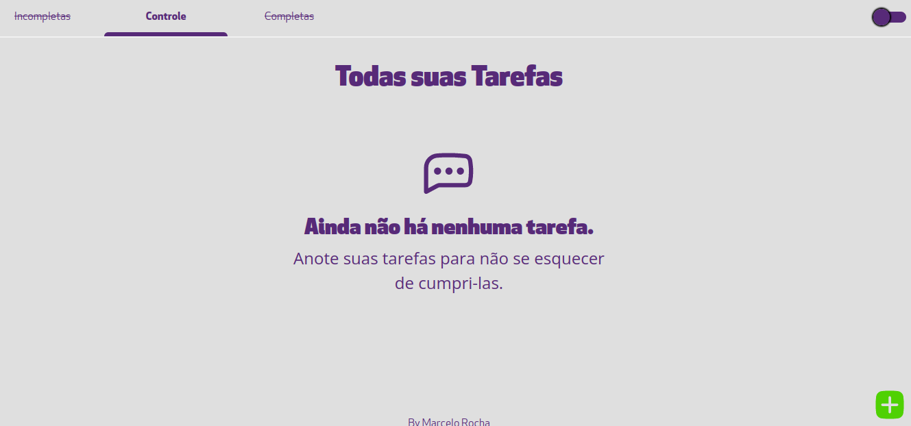
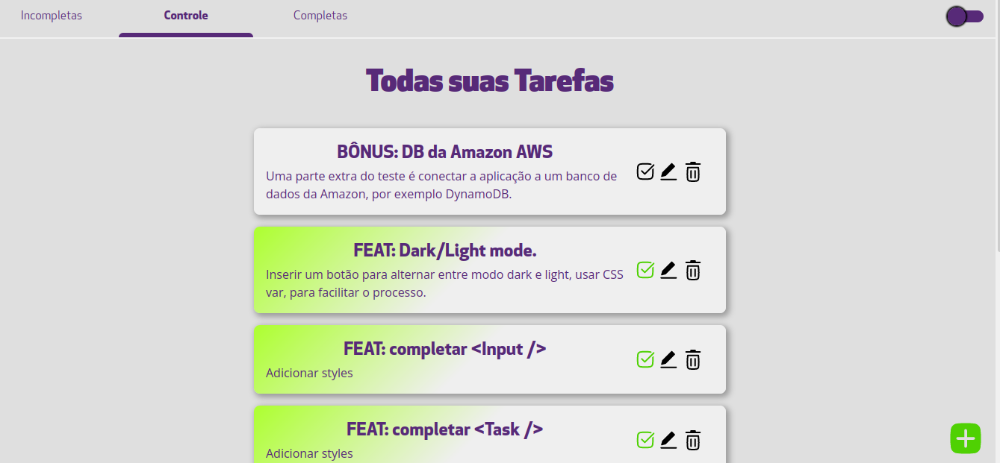
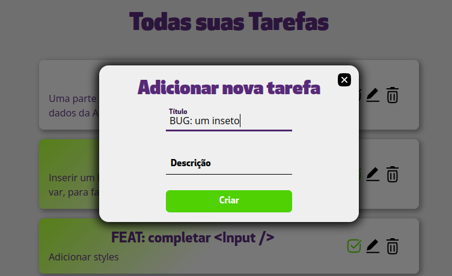
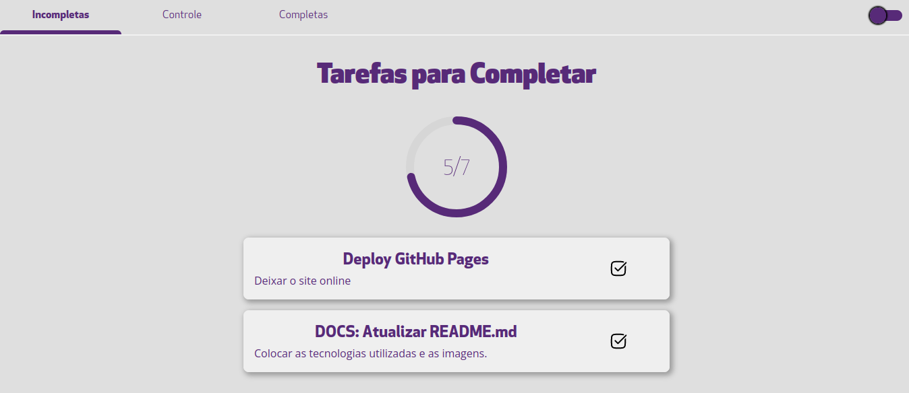
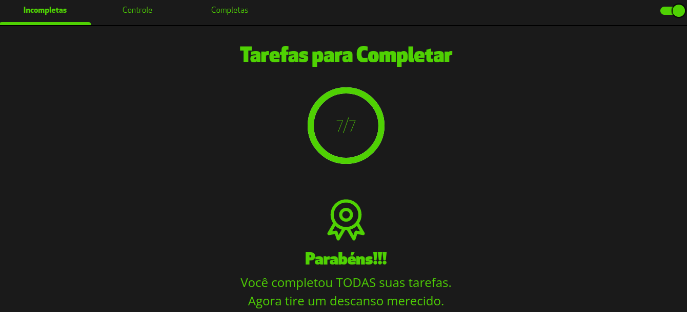
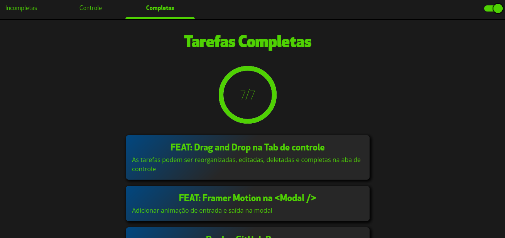

# Teste SelfSolutions

---

<a href="https://celorocha.github.io/Teste-SelfSolutions/" target='_blank'>Veja online</a>

---

Teste de bolsa para estágio home-office na Startup SelfSolutions.

## Enunciado:

### Aplicação de lista de tarefas

#### Premissas

Faça uma aplicação com campo de entrada de dados para que o usuário
digite tarefas, que serão enviadas em uma lista quando o usuário
pressiona enter ou clica em um botão.

As tarefas inseridas devem ser visualizadas na tela.

Vaga back-end: Estruturar os dados em um banco de dados.

#### Bônus

* As tarefas podem ser marcados como "completed";
* O usuário pode editar, ou remover as tarefas inseridas;
* O usuário pode ver uma lista com as tarefas concluídas;
* Ao fechar a janela do navegador, as tarefas serão armazenadas em
localStorage e quando o usuário retornar, os dados serão recuperados;
* Utilizar banco de dados na Amazon AWS (RDS ou dynamoDB).

*Para a vaga de back-end, o front-end desenvolvido não será avaliado.*

---

## Solução:

O enunciado pede uma aplicação de tarefas do tipo CRUD: create, read, update, delete.

Consistindo em uma To-Do-List, também é necessário uma opção para verificar facilmente todas as tarefas concluídas, portanto também haverá uma apenas com as que ainda faltam completar também.

As informações devem ser guardadas e resgatadas a partir do localStorage, também pode utilizar um banco de dados na Amazon AWS (RDS ou dynamoDB) especificamente, portanto não posso utilizar Firebase para fazer uma fácil integração com um banco de dados.

### Features:

- Light/Dark Mode;
- Animações em abas e na modal;
- Drag & Drop, para reordenar as tarefas na aba de controle;
- Aba de controle, para criar, editar, deletar e reordenar apenas na mesma;
- É possível marcar a tarefa como feita na aba de progresso e na de controle;
- Abas para ver apenas tarefas em progresso e tarefas completas;
- Aba de progresso lhe parabeniza após a conclusão de todas tarefas;
- Barra de progresso;
- Input (igual da Material UI, porém feita utilizando engenharia reversa);

### Tecnologias utilizadas:

No desenvolvimento:

- ReactJS;
- Jest (testes unitários);
- React Beautifull DnD;
- React Framer-Motion;
- React Circular Progressbar
- localStorage;
- eslint;
- prettier;
- javascript;
- sass;

#### React Router:

Esta pequena sessão é para explicar o uso da pasta tabs, e não uma pasta pages.
Considerando que neste caso as novas páginas são pequenas e são poucas, parecia
desnecessário a utilização de rotas na aplicação, portanto o React Router não foi
utilizado (caso seja um bom exemplo de conhecimento, o repositório "gaming-site" o
utiliza).

Como a página não muda sua rota, a denominação "pages", parecia incoerente, por isso seu nome
foi alterado neste projeto.

### Testes com Jest:

**Testes unitários** foram realizados durante a execução deste projeto. Portanto os testes como do próprio componente App, se tornaram pequenos, já que não precisavam testar novamente funcionalidades já garantidas em outros testes.

A mockagem de funções foi muito necessária, devido a utilização do contexto com as tasks estar diretamente sobre o aplicativo inteiro.

O comando para a execução dos testes é: **npm run test**.

### Aba de Controle:

Nessa aba é possível aplicar todas as interações com as tarefas, inserí-las, editá-las,
remove-las e marcar como finalizada.
É possível segurar o click do mouse, para arrastar as tarefas reordenando-as na lista.

A opção de inserir uma tarefa nova, aparece no canto inferior direito, abrindo uma modal
para a inserção dos dados.

### Modal:

A modal entra animada com a animação do framer motion.

### Aba de tarefas incompletas:

Nessa aba, aparecem apenas as tarefas incompletas, a única opção possível é completá-las =,
enquanto que existe uma progressbar animada.

Quando todas as tarefas são completas, existe uma tela preparada.

### Aba de tarefas completas:

Aparecem todas as tarefas feitas, sem opção de edição.

